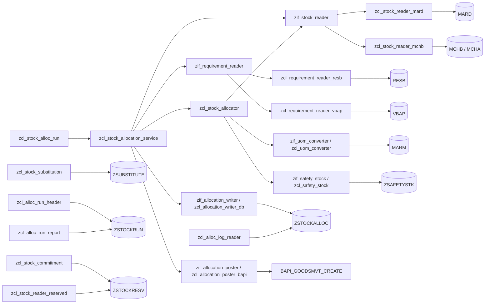

# stock-allocation-fun

A stock allocation solution written in ABAP for an existing SAP system.

Given a material and a plant, it reads the available stock from the storage
locations (`MARD`), collects the open requirements from reservations (`RESB`),
and distributes the stock across those requirements. The result reports how much
was allocated per requirement and per storage location, and how much is still
missing. Allocation runs can be recorded in a custom log table (`ZSTOCKALLOC`).

All custom code is prefixed with `Z` and lives in `src/`. SAP standard objects
needed for integration are stubbed in `stubs/` because the open source runtime
(`open-abap-core`) does not ship business content.

## Development

Requires Node.js 22+ and `git` on the PATH (the toolchain clones
`open-abap/open-abap-core` when it runs).

```
npm install
npm test
```

| Script           | Purpose                                                    |
| ---------------- | ---------------------------------------------------------- |
| `npm run lint`   | `abaplint` static analysis                                  |
| `npm run build`  | transpile `src/` + `stubs/` to JavaScript in `output/`      |
| `npm run unit`   | run the transpiled ABAP Unit tests on Node                  |
| `npm test`       | all of the above                                            |

The transpiled test runner uses SQLite (`@abaplint/database-sqlite`); the
connection is set up in `test/setup.mjs`.

## Architecture



* `zif_stock_reader` / `zcl_stock_reader_mard` - read the usable stock per
  storage location. `zcl_stock_reader_mchb` is the batch-level alternative
  (one row per batch, with the expiry date from `MCHA`).
* `zif_requirement_reader` / `zcl_requirement_reader_resb` - read open
  requirements from reservations. `zcl_requirement_reader_vbap` reads open sales
  order items instead, including their sales unit of measure.
* `zcl_stock_allocator` - the allocation engine. Requirements are processed by
  priority, then requirement date, then id; each one consumes usable stock from
  the storage locations in turn. A policy switches which stock categories
  (quality inspection, blocked, restricted, in transit) may be used, whether
  batches are consumed FEFO, and requirement quantities are converted to the
  base unit through `zif_uom_converter` / `zcl_uom_converter` (`MARM`).
* `zif_allocation_writer` / `zcl_allocation_writer_db` - persist the result.
* `zif_allocation_poster` / `zcl_allocation_poster_bapi` - post the allocated
  quantities as a goods movement through `BAPI_GOODSMVT_CREATE`.
* `zcl_stock_allocation_service` - facade that wires the defaults together.
* `zcl_stock_alloc_run` - runs the facade for a list of material/plant requests
  and aggregates the results into statistics and a shortage report. Requests with
  an empty material or plant are skipped and counted in `stats-skipped`. Large
  lists can be processed package-wise via `run_in_packages( )`.
* `zcl_alloc_log_reader` - reads and summarizes the recorded `ZSTOCKALLOC` run
  log (per-run totals and material counts).
* `zcl_stock_substitution` - reads the `ZSUBSTITUTE` substitution rules and
  reports the available quantity of a material including its substitutes, with
  the `ZSAFETYSTK` safety stock already deducted.
* `zcl_alloc_run_header` - tracks a run per material/plant in `ZSTOCKRUN`
  (status running/done plus aggregated requested, allocated and shortage
  quantities).
* `zcl_alloc_run_report` - reporting view over the stored run headers, adding a
  derived coverage percentage per run and material, a CSV text output
  (`to_lines`) and an ALV-style field catalog (`field_catalog`).
* `zcl_stock_commitment` / `zcl_stock_reader_reserved` - commit allocated
  quantities to `ZSTOCKRESV` and subtract those open commitments from the
  available stock, so a second run sees the stock as already used. Commitments
  carry a creation date; `read_expired( )` lists them and `purge_before( )` /
  `purge_older_than( )` clean up stale ones.
* `zif_safety_stock` / `zcl_safety_stock` - read the `ZSAFETYSTK` safety stock per
  material / plant / storage location. The allocator keeps that quantity in the
  bins, so it can never be allocated.

## Usage

```abap
DATA(lo_service) = NEW zcl_stock_allocation_service( ).

DATA(lt_result) = lo_service->allocate( iv_matnr = 'MAT-1'
                                        iv_werks = '1000' ).

LOOP AT lt_result INTO DATA(ls_result).
  " ls_result-allocated_qty / ls_result-shortage_qty / ls_result-allocations
ENDLOOP.
```

To persist the run:

```abap
DATA(lt_result) = lo_service->allocate_and_record( iv_run_id = 'RUN-0001'
                                                   iv_matnr  = 'MAT-1'
                                                   iv_werks  = '1000' ).
```

To allocate, post the goods issue and record the run in one call:

```abap
DATA(ls_run) = lo_service->run_with_posting( iv_run_id = 'RUN-0001'
                                             iv_matnr  = 'MAT-1'
                                             iv_werks  = '1000' ).
" ls_run-allocations / ls_run-posting-document_number
```

To use batch-level FEFO, enable it in the allocation policy and inject the batch
reader:

```abap
DATA(ls_policy) = VALUE zcl_stock_allocator=>ty_policy( use_fefo = abap_true ).

DATA(lo_service) = NEW zcl_stock_allocation_service(
  io_stock_reader = NEW zcl_stock_reader_mchb( )
  is_policy       = ls_policy ).
```

To process several materials at once:

```abap
DATA(lo_run) = NEW zcl_stock_alloc_run( ).

DATA(ls_overview) = lo_run->run( VALUE zcl_stock_alloc_run=>ty_request_tt(
  ( matnr = 'MAT-1' werks = '1000' )
  ( matnr = 'MAT-2' werks = '1000' ) ) ).

" ls_overview-materials / ls_overview-stats / ls_overview-shortages
```

All dependencies can be injected through the constructor for testing.

To reserve the allocated quantities so a later run sees them as used, and to
release the reservation once the goods issue is posted:

```abap
DATA(lt_result) = lo_service->run_with_commitment( iv_run_id = 'RUN-0001'
                                                   iv_matnr  = 'MAT-1'
                                                   iv_werks  = '1000' ).

DATA(ls_run) = lo_service->run_post_and_commit( iv_run_id = 'RUN-0001'
                                                iv_matnr  = 'MAT-1'
                                                iv_werks  = '1000' ).
```

## Documentation

* `PLAN.md` - the original task description and requirements.
* `NOTES.md` - progress log, decisions and conventions.
* `ANOMALIES.md` - issues found in the abaplint / transpiler toolchain.
