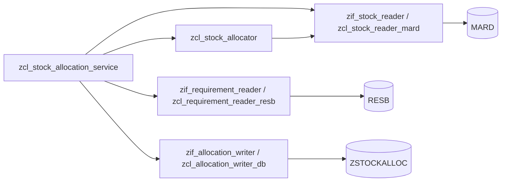

# stock-allocation-fun

A stock allocation solution written in ABAP for an existing SAP system.

Given a material and a plant, it reads the available stock from the storage
locations (`MARD`), collects the open requirements from reservations (`RESB`),
and distributes the stock across those requirements. The result reports how much
was allocated per requirement and per storage location, and how much is still
missing. Allocation runs can be recorded in a custom log table (`ZSTOCKALLOC`).

All custom code is prefixed with `Z` and lives in `src/`. SAP standard objects
needed for integration are stubbed in `stubs/` because the open source runtime
(`open-abap-core`) does not ship business content.

## Development

Requires Node.js 22+ and `git` on the PATH (the toolchain clones
`open-abap/open-abap-core` when it runs).

```
npm install
npm test
```

| Script           | Purpose                                                    |
| ---------------- | ---------------------------------------------------------- |
| `npm run lint`   | `abaplint` static analysis                                  |
| `npm run build`  | transpile `src/` + `stubs/` to JavaScript in `output/`      |
| `npm run unit`   | run the transpiled ABAP Unit tests on Node                  |
| `npm test`       | all of the above                                            |

The transpiled test runner uses SQLite (`@abaplint/database-sqlite`); the
connection is set up in `test/setup.mjs`.

## Architecture



* `zif_stock_reader` / `zcl_stock_reader_mard` - read stock per storage location.
* `zif_requirement_reader` / `zcl_requirement_reader_resb` - read open
  requirements from reservations.
* `zcl_stock_allocator` - the allocation engine. Requirements are processed by
  priority, then requirement date, then id; each one consumes usable stock from
  the storage locations in turn. A policy switches which stock categories
  (quality inspection, blocked, restricted, in transit) may be used.
* `zif_allocation_writer` / `zcl_allocation_writer_db` - persist the result.
* `zcl_stock_allocation_service` - facade that wires the defaults together.

## Usage

```abap
DATA(lo_service) = NEW zcl_stock_allocation_service( ).

DATA(lt_result) = lo_service->allocate( iv_matnr = 'MAT-1'
                                        iv_werks = '1000' ).

LOOP AT lt_result INTO DATA(ls_result).
  " ls_result-allocated_qty / ls_result-shortage_qty / ls_result-allocations
ENDLOOP.
```

To persist the run:

```abap
DATA(lt_result) = lo_service->allocate_and_record( iv_run_id = 'RUN-0001'
                                                   iv_matnr  = 'MAT-1'
                                                   iv_werks  = '1000' ).
```

All dependencies can be injected through the constructor for testing.

## Documentation

* `PLAN.md` - the original task description and requirements.
* `NOTES.md` - progress log, decisions and conventions.
* `ANOMALIES.md` - issues found in the abaplint / transpiler toolchain.
